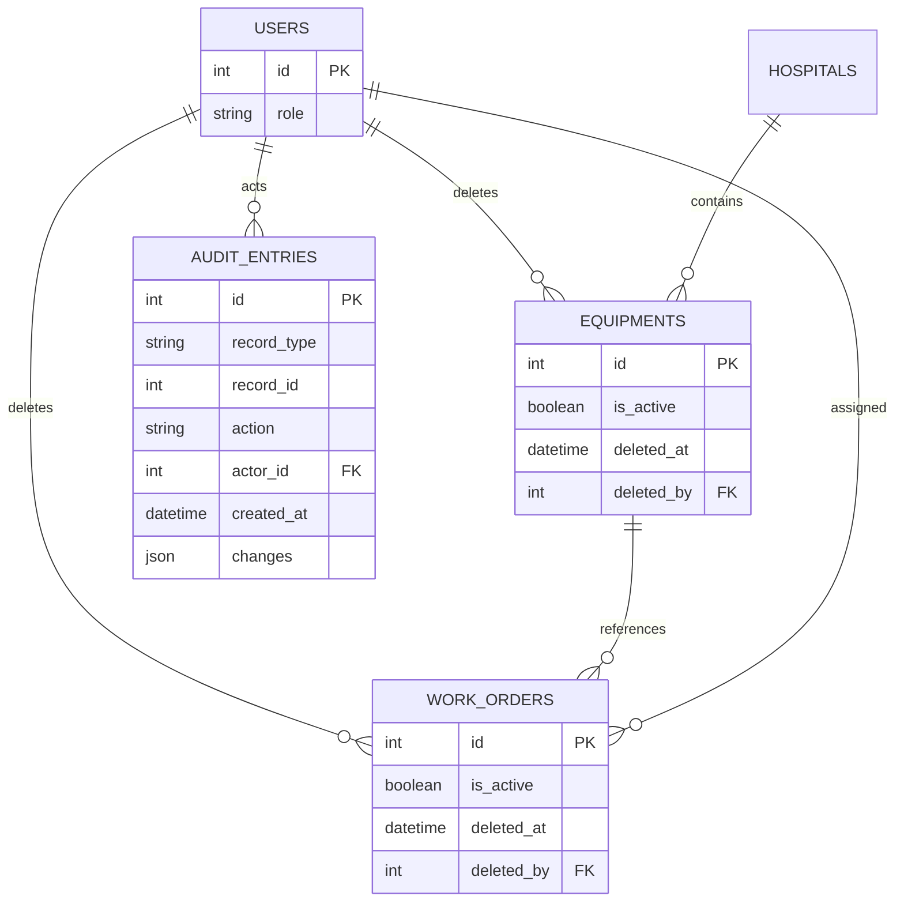

# medflow

## Local setup

Run setup from any directory:

```bash
bash /path/to/medflow/bin/setup.sh
```

The setup script requires `python3` (or `python` on Windows) with the `venv`
module and `npm`. It creates the root `.venv` only if it is missing, installs
backend and frontend dependencies, and copies `backend/.env.example` to the
root `.env` only when `.env` does not already exist. Review the copied file
and set values for your local environment; setup never overwrites an existing
`.env`.

## Roles and permissions

Endpoint authorization uses named permissions from
`backend/app/permissions.py`. `ROLE_PERMISSIONS` is the single source of truth
for the three existing roles; keeping the mapping in application code avoids a
schema migration or role-seeding requirement while still allowing endpoints to
depend only on permissions. Permissions are resolved from the user's current
database role on every request, not copied into the login token.

`GET /auth/me` returns the signed-in user's current permissions for frontend
visibility checks. Admins can inspect all role definitions through `GET /roles`,
which requires `roles:read`. Adding a role requires extending the
`UserRole` enum and `ROLE_PERMISSIONS` mapping; existing endpoints do not need
to change.

## Authentication tokens

`POST /auth/token` returns a 15-minute access token and a 7-day refresh token
by default. Configure `ACCESS_TOKEN_EXPIRE_MINUTES` and
`REFRESH_TOKEN_EXPIRE_DAYS` to change those lifetimes. Refresh tokens rotate
on every exchange; a reused token revokes the whole token chain. Logging out
revokes the presented refresh token.
Refresh token hashes, expiry, revocation, and chain identifiers are stored in
the `refresh_tokens` table. The application does not create or alter tables at
startup. For an existing PostgreSQL database, apply
[`backend/migrations/001_create_refresh_tokens.sql`](./backend/migrations/001_create_refresh_tokens.sql),
[`backend/migrations/002_soft_deletes_audit_trail.sql`](./backend/migrations/002_soft_deletes_audit_trail.sql),
[`backend/migrations/003_index_service_reports.sql`](./backend/migrations/003_index_service_reports.sql),
and
[`backend/migrations/004_remove_hospital_manager_role.sql`](./backend/migrations/004_remove_hospital_manager_role.sql)
before deploying these changes. For a fresh database, run the idempotent
[`db/sql/schema.sql`](./db/sql/schema.sql).
Migration 004 converts existing `hospital_manager` users to the read-only
`auditor` role before removing that role from the PostgreSQL enum.

## Soft deletes and audit history

Deleting an equipment asset or work order marks it inactive; list and
analytics queries exclude inactive rows while foreign-key references remain
intact. Admins can inspect and restore inactive rows. Each create, update,
status change, soft delete, and restore creates an audit row in the same
transaction as the record change. Audit snapshots store only the changed
fields as `{before, after}` values; create events have a null `before`
snapshot. Audit rows have no mutation API.

The schema SQL also adds the read-only `auditor` role, which can inspect active
asset and job records and their history, but cannot mutate records or view the
admin-only inactive lists.

## Service report uploads

`POST /service-reports/upload` accepts a multipart form with `work_order_id`, `file`,
and optional `notes`. Users need the `report:upload` permission. The work order
must be active and assigned to the uploading technician unless the caller is a
clinical admin. S3 must be configured with `S3_BUCKET`. The file is stored
under a unique key in the `service-reports/work-orders/` prefix using configured
AWS credentials (`AWS_ACCESS_KEY_ID` and `AWS_SECRET_ACCESS_KEY`) or the SDK's
standard profile/IAM credential providers. The database
stores an `s3://` reference and report metadata; no public object ACL is
set. Uploads default to a 10 MiB limit, configurable with
`MAX_SERVICE_REPORT_UPLOAD_BYTES`.

The object is uploaded before its database row is committed. If the database
write fails, the API attempts to remove the uploaded object to avoid leaving an
orphan. Apply
[`backend/migrations/003_index_service_reports.sql`](./backend/migrations/003_index_service_reports.sql)
to an existing database, or run `db/sql/schema.sql` on a fresh database. Reports
can be listed with `GET /service-reports`; the endpoint supports `work_order_id`,
`limit` (maximum 100), and `offset` filters and requires `report:read`.
Field technicians can upload reports from the **Upload report** action on an
assigned work order in the dashboard. The upload dialog accepts image, PDF, and
text files and optionally records notes.

Example local upload:

```bash
curl -X POST http://localhost:8000/service-reports/upload \
  -H "Authorization: Bearer <access-token>" \
  -F "work_order_id=1" \
  -F "file=@sample_service_report.txt" \
  -F "notes=Calibration output"
```



The browser stores both bearer tokens in `localStorage` to fit the existing
token-based client and Lambda API setup. This keeps sessions across browser
restarts, but browser script access means an XSS vulnerability could expose
them; deployments should enforce a strong content-security policy and avoid
untrusted scripts.

## PostgreSQL SQL files

The SQL source of truth for the PostgreSQL database is in `db/sql/`:

- `schema.sql` creates the current MedFlow tables, enum types, constraints, and
  indexes. It is safe to rerun and does not drop existing data.
- `seed.sql` idempotently upserts the demo hospitals, users, equipment, and
  work orders from the former `backend/seed.py`.
- `queries.sql` contains operational examples for equipment, work-order,
  service-report, and audit-history reporting.

The FastAPI backend connects to PostgreSQL using `DATABASE_URL` in the
repository-root `.env` or process environment. Run
`bash /path/to/medflow/bin/seed.sh` to apply `schema.sql` and then `seed.sql`
to that same configured database. The script requires `psql` and
`SEED_USER_PASSWORD`; it hashes that password with the backend's bcrypt helper
and does not print the password or hash. Environment variables take precedence
over `.env`.

The seed process is idempotent: it updates demo records to the SQL seed values
and preserves existing demo-user passwords by default. To overwrite the seeded
users' passwords with `SEED_USER_PASSWORD`, run
`bash /path/to/medflow/bin/seed.sh --reset`. It prompts for confirmation; add
`--yes` only for intentional automated use. The schema and seed are not applied
automatically when the API starts, so the database connection and setup remain
explicit.
